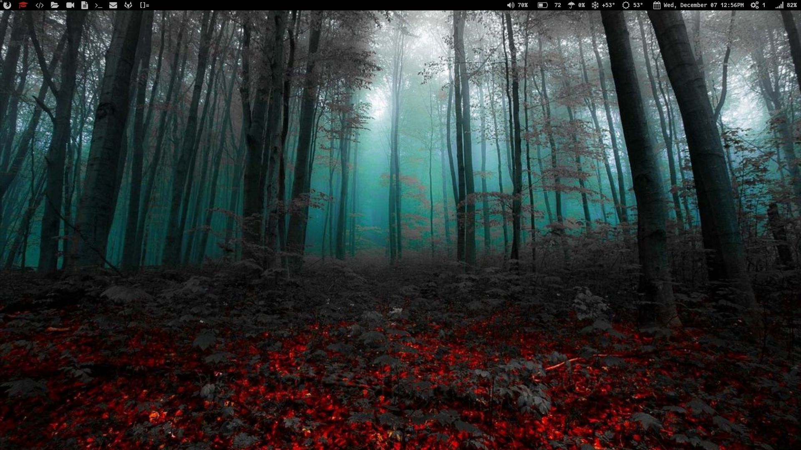

# This is my current setup of DWM.
### This repo includes all of my currently used suckless utilities and files, such as:
* dwm
* ST (simple terminal)
* dmenu
* dwm blocks (for my status bar)
* .dwm (autostart file)
* patches I used

